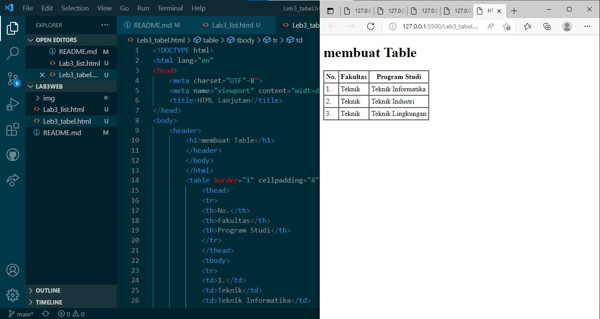

# Lab3web

| Nama        | Fikri abei     |
|------------ | -------------- |
| Nim         | 3122010417     |
| Kelas       | TI.20.A.1      |
| Matkul      | Pemograman web |

## Langkah langkah praktikum
Persiapan membuat dokumen HTML dengan nama file lab3_list.html seperti berikut.
Modul Praktikum Pemrograman Web

## Membuat Unorderd List
Kemudian tambakan kode untuk membuat Unordered List, setelah deklarasi ordered list pada
section unordered-list, seperti berikut.

## Membuat Description List
Kemudian tambahkan kode untuk membuat description list setelah deklarasi unorderd-list.

## Membuat Tabel Mengatur Margin dan Padding
Untuk mengatur margin dan padding pada cel data, tambahkan atribut cellpadding dan
cellspacing pada tag table.

## Menggabungkan Sel Data
Untuk menggabungkan sel data, gunakan atribut rowspan dan colspan. Atribut rowspan untuk
menggabungkan baris (secara vertikal) dan colspan untuk menggabungkan kolom (secara
horizontal).

## Membuat Form
Buat file baru dengan nama lab3_form.html seperti berikut.
Kemudian selanjutnya tambahkan kode untuk membuat tabel sederhana seperti berikut:

## Menabahkan Style pada Form
Agar tampilan form lebih menarik, bisa ditambahkan CSS seperti berikut.

## Pertanyaan dan Tugas
1. Buatlah form yang menampilkan dropdown menu dan listbox dengan multiple selection.

## Jawaban
